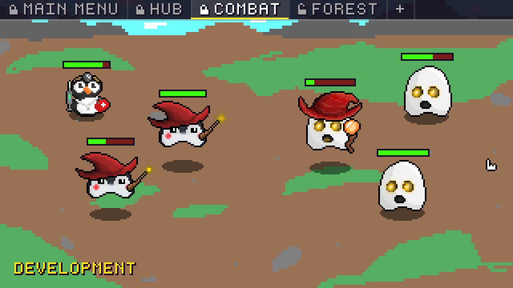
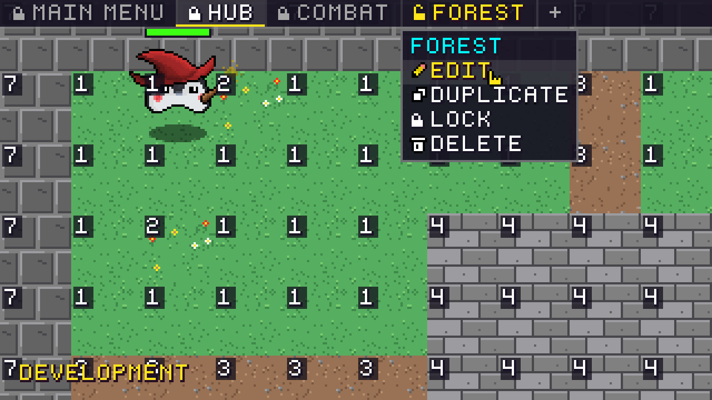
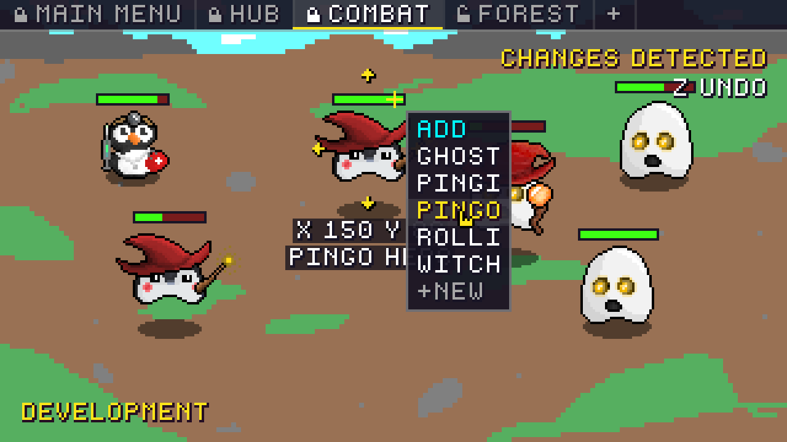
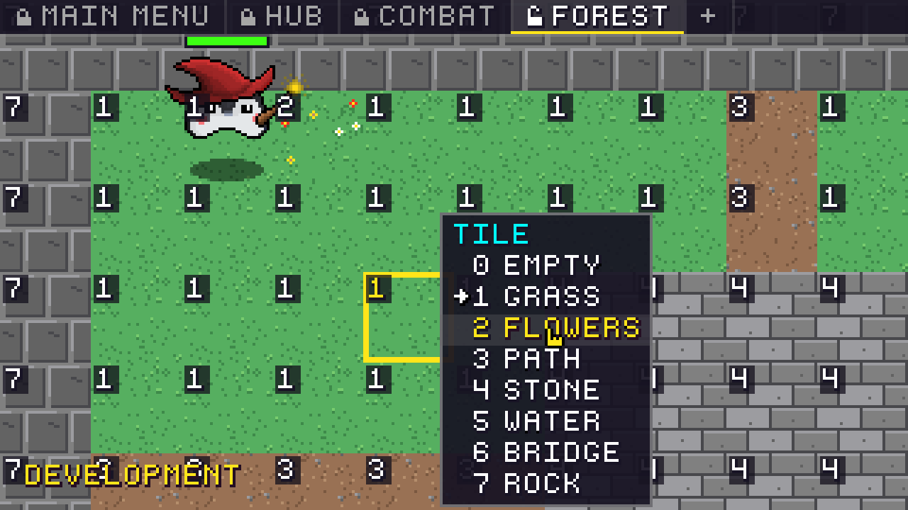

# Pingo Engine

A tiny 2D engine for pixel games, written in C++20 with [raylib](https://www.raylib.com).
You build your scenes while the game runs, place characters with the mouse, and when
you're happy, one key press brings the world to life.

**📖 Documentation with lots of screenshots: [v-q-m.github.io/Pingo-Engine](https://v-q-m.github.io/Pingo-Engine/)**



> Alpha 0.0.1: things are still moving, and so are the characters.

## Features

- **Everything is a scene.** In the Development build all scenes sit at the top of the window like
  browser tabs. Right click a tab to edit, duplicate, lock or delete it, the **+** creates a new one.
- **Three kinds of scenes:**
  - **Menu:** texts and buttons, one of the menus is the entry point of the game.
  - **Tileset:** a world made of 32 pixel tiles, the player walks tile by tile.
  - **Normal:** characters placed freely, with heroes, enemies, health bars and music.
- **Build with objects.** Select, drag, add, duplicate and delete characters right in the scene.
  Invent new object types with a small form and undo everything with `Z` / `Y`.
- **Press play.** `Shift` + `Enter` plays the open scene, `Shift` + `Esc` brings you back to building.
- **Paint tiles** by typing digits or picking them from a menu. Every change is saved instantly.
- **Menus without code:** add buttons, choose where they lead, change text and color.
- A hand-drawn pixel font with icons, a custom cursor, a splash screen and three build modes.

| Scene tabs | Object editor | Tile editor |
| --- | --- | --- |
|  |  |  |

## Getting started

You need a C++20 compiler, CMake 3.20 or newer, raylib and nlohmann/json.

### Terminal (macOS)

```bash
brew install cmake raylib nlohmann-json
git clone https://github.com/V-Q-M/Pingo-Engine.git
cd Pingo-Engine
cmake -S . -B build -DPINGO_BUILD_MODE=Development
cmake --build build
cd build && ./PingoLegends
```

Start the game from inside the build folder: it loads `assets/` relative to the working
directory, and every build copies the assets there.

### CLion

1. Install the libraries as shown above.
2. Open the project folder. CLion picks up the three CMake profiles
   **Release**, **Debugging** and **Development**.
3. Choose a profile, select the **PingoLegends** run configuration and press **Run**.

On Linux or Windows, install raylib and nlohmann/json so CMake's `find_package` can find them.
The engine is developed and tested on macOS.

## Build modes

| Mode | What you get |
| --- | --- |
| `Release` | The finished game, no tools. Starts with the splash screen. |
| `Debugging` | Playable, plus FPS display, hitboxes and scene keys (`F1` to `F3`). |
| `Development` | The world stands still: scene tabs, editors and a free camera. Starts at the entry point. |

Set the mode with `-DPINGO_BUILD_MODE=<mode>`. In the Development build the editors also save
back into the project's `assets/` folder, so your changes survive the next build.

## Project structure

```
assets/
  backgrounds/   images for the Background dropdown
  characters/    one JSON file per character type
  maps/          tile maps of tileset scenes
  scenes/        scenes.json plus menu and normal scenes
  templates/     Default templates of each scene type
  tilesets/      tile names and walkability
  fonts/ music/ sprites/
docs/            the documentation website
src/
  Engine/        scenes, editors, renderer, UI
  Game/          scene types, characters, splash screen
  main.cpp
```

## Keys

| Key | Action |
| --- | --- |
| `Shift` + `Enter` | Play the open scene (Development build) |
| `Shift` + `Esc` | Back to building, in the current scene |
| `Esc` | Close the open window, otherwise pause |
| `WASD` / arrows | Move the free camera, `Shift` for speed |
| Click / drag | Select and move characters and menu elements |
| Right click | Add menu in empty space, actions on objects and tabs |
| `Del` / `Backspace` | Delete the selection |
| `Z` / `Y` | Undo / redo |
| `0` to `9` | Set the selected tile |
| `Shift` + click | Run a menu button |
| `H` | Show or hide the key help |
